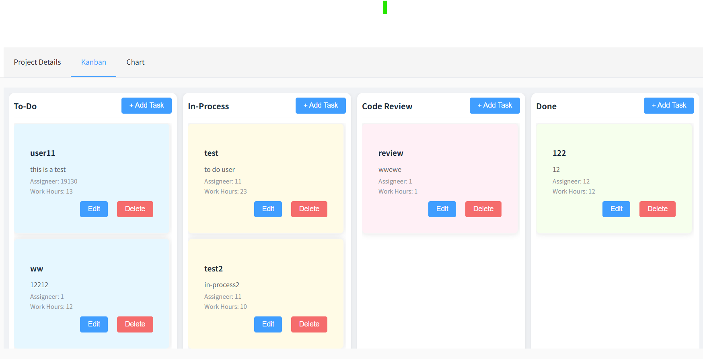
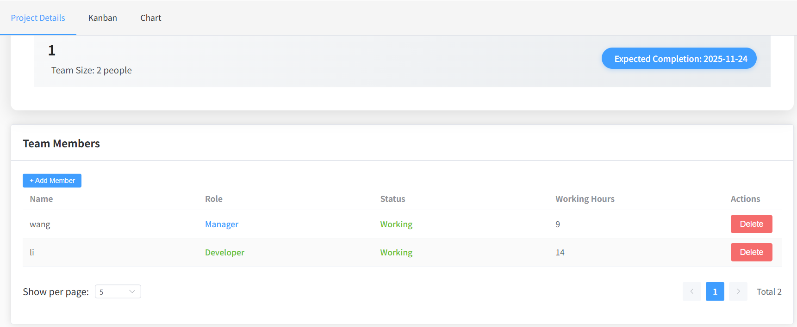

# Onion - 项目管理系统

## 项目介绍

Onion 是一个基于 **Spring Boot（后端）** 和 **Vue 3（前端）** 技术栈开发的项目管理系统，旨在为团队提供高效的项目协作、任务看板（Kanban）管理、用户管理等功能，助力团队提升项目管理效率。



## 技术栈

### 后端技术
- 框架：Spring Boot
- 安全：Spring Security + JWT
- 持久层：Spring Data JPA
- 工具：JWT 工具类、哈希工具类、随机工具类
- 数据库：H2 数据库（可扩展为 MySQL 等关系型数据库）

### 前端技术
- 框架：Vue 3
- 路由：Vue Router
- 网络请求：Axios（封装于 `request.js`）
- 组件化：Vue 单文件组件（.vue）

## 项目结构

### 后端（OnionServer）
```
OnionServer
├── src
│   ├── main
│   │   ├── java
│   │   │   └── com.onion.onionserver
│   │   │       ├── config          # 配置类（跨域、Spring Security、Web配置等）
│   │   │       ├── controller      # 控制器（接口层，处理HTTP请求）
│   │   │       ├── manager         # 业务管理类（封装核心业务逻辑）
│   │   │       ├── model
│   │   │       │   ├── dao         # 数据实体类（对应数据库表）
│   │   │       │   ├── dto         # 数据传输对象（接口入参、出参封装）
│   │   │       │   ├── enums       # 枚举类（状态、类型等）
│   │   │       │   └── repo        # 数据访问层（JPA Repository）
│   │   │       ├── service         # 服务类（如Redis服务）
│   │   │       ├── util            # 工具类（JWT、哈希、随机数等）
│   │   │       └── OnionServerApplication  # 应用启动类
│   │   └── resources               # 资源文件（配置文件、静态资源）
│   └── test                        # 测试类（可选）
├── DataBase.db                     # H2 数据库文件（示例）
├── db_init.sql                     # 数据库初始化脚本
├── build.gradle                    # 构建配置文件
└── gradlew/gradlew.bat             # Gradle 脚本
```

### 前端（onionweb）
```
onionweb
├── src
│   ├── api                         # 接口请求封装（与后端交互）
│   ├── assets                      # 静态资源（图片、样式等）
│   ├── components                  # 公共组件
│   │   ├── layouts                 # 布局组件（如 MainLayout）
│   │   ├── Project.vue             # 项目相关公共组件
│   │   └── User.vue                # 用户相关公共组件
│   ├── router                      # 路由配置（index.js）
│   ├── utils                       # 工具类（如 request.js 封装Axios）
│   └── views                       # 页面视图组件
│       ├── project                 # 项目模块视图
│       │   ├── ChartView.vue       # 项目图表视图
│       │   ├── KanbanView.vue      # 看板视图
│       │   ├── ProjectDetailLayout.vue # 项目详情布局
│       │   └── ProjectInfoView.vue # 项目信息视图
│       ├── LoginView.vue           # 登录视图
│       ├── ProfileView.vue         # 个人资料视图
│       ├── ProjectView.vue         # 项目列表视图
│       ├── RegisterView.vue        # 注册视图
│       └── UserView.vue            # 用户管理视图
├── App.vue                         # 根组件
├── main.js                         # 入口文件
├── index.html                      # 入口HTML
├── package.json                    # 依赖配置
└── ...
```

## 功能模块

### 用户管理
- 用户注册、登录、个人信息管理
- 用户权限控制（基于Spring Security + JWT）

### 项目管理
- 项目创建、编辑、删除
- 项目成员管理（添加、移除成员）
- 项目信息查看与统计

### 看板（Kanban）管理
- 任务卡片创建、移动、状态更新
- 任务分类与进度跟踪

## 快速启动

### 后端启动
1. 确保安装 JDK 1.8+ 和 Gradle
2. 进入 `OnionServer` 目录，执行以下命令启动后端：
   ```bash
   ./gradlew bootRun
   ```
3. 后端默认启动端口为 `8080`，可通过 `application.properties` 配置修改。

### 前端启动
1. 确保安装 Node.js 和 npm
2. 进入 `onionweb` 目录，安装依赖：
   ```bash
   npm install
   ```
3. 启动前端开发服务器：
   ```bash
   npm run dev
   ```
4. 浏览器访问 `http://localhost:3000`（具体端口以实际启动日志为准）。

## 许可证

[MIT](LICENSE)